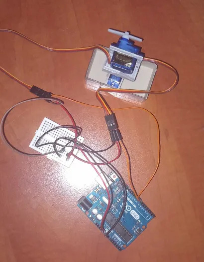

# ElectroCom Component Detection

An electronic component classifier that uses a custom trained YOLOv8 model for live tracking and the ElectroCom dataset for training.
This project has 2 versions, one that uses software exclusively, and one that also has a 2 servo motor stand that takes coords from webcam.

## Generally

* Uses the ElectroCom-61 dataset to train a yolov8s model on 12 selected classes!
* Not a simple classifier, has bounding boxes!
* Weights are exported to .onnx
* Full training info is in the .ipynb file (link below)

## Dataset

* https://universe.roboflow.com/datasetsynthesis/electrocom-61
* about 2150 images, 61 classes of electronic components, varied lighting/angles/backgrounds
* We filter down to 12 classes (full list below)

## Why I didn't have a custom dataset (!)
A custom dataset wasn't collected because I didn't have materials with me at the time. If I started after coming home and having access to my materials, I wouldn't meet the deadline!
### If i were to create my own dataset, how would I go about it?
- Take about 20-30 pics of each item in different settings(angles,lighting).
- Put them all into seperate folders.
- Use RoboFlows labeling tool to create custom bounding boxes and export it in yolov8 format.
- Each class would be labeled numerically. (i.e. 0-9 for 10 classes)

### Selected classes

Picked larger/medium components with distinct shapes so the model has an easier time. (small items like resistors or LEDs are way too similar to each other)

```
Arduino-Uno, Arduino-Nano, Arduino-Mega,
Breadboard, LCD-Display, OLED-Display,
9-Volt-Battery, 3-3-Volt-Battery, 1-5-Volt-Battery,
ESP32, Servo-Motor, Keypad
```

### Dataset structure

```
ElectroCom.yolov8/
├── data.yaml
├── train/
│   ├── images/
│   └── labels/
├── valid/
│   ├── images/
│   └── labels/
└── test/
    ├── images/
    └── labels/
```

Labels are .txt files per image with class index + bounding box coords.

## Weights & notebook

* LINK TO WEIGHTS: https://www.mediafire.com/file/li5otja7crz4egj/best.onnx/file
* LINK TO NOTEBOOK: https://colab.research.google.com/drive/1e1FRskLH6LZpXtDoFnHjWZt47VjkZM1l?usp=sharing

## Model & Training

We use `yolov8s.pt`. It offers a good balance of speed and accuracy for laptop power live tracking. (`yolov8n.pt` for faster training, `yolov8m.pt` for more accuracy)

* T4 GPU on Google Colab because CPU training is painfully slowwww
* 100 epochs, patience=30 (early stopping)
* imgsz=640, batch=16 so the model can capture details of each item

### Augmentation

Since we don't have many images per class, augmentation helps the model learn more with the same images!:

* `degrees=15`  random rotation up to 15 degrees
* `fliplr=0.5`  horizontal flip 50% chance
* `hsv_h/s/v`  random hue, saturation, brightness shifts

## Results

Validated after 100 epochs:

| Metric | Value |
|---|---|
| mAP50 | 0.928 |
| mAP50-95 | 0.702 |
| Precision | 0.852 |
| Recall | 0.938 |

### Per-class

| Class | mAP50 | mAP50-95 |
|---|---|---|
| Arduino-Uno | 0.995 | 0.861 |
| Arduino-Nano | 0.954 | 0.664 |
| Arduino-Mega | 0.995 | 0.843 |
| Breadboard | 0.989 | 0.818 |
| 3-3-Volt-Battery | 0.953 | 0.651 |
| 1-5-Volt-Battery | 0.971 | 0.657 |
| Servo-Motor | 0.828 | 0.647 |
| Keypad | 0.735 | 0.476 |

Servo-Motor only had 2 validation images so that number is unreliable. Note that keypad also scores lower.

## Version 1
* Run `detectionnostand.py` to test without servo communication!

### Setup

```bash
pip install ultralytics opencv-python
python detectionnocam.py
```

## Version 2

Same as version 1, except bounding box center coordinates get sent to an Arduino which converts them to servo angles for a 2 servo stand. Mount a laser pointer (or anything really) on the top servo.
### Setup
 - RUN ARDUINO CODE BEFOREHAND!
 - Close the IDE while .ino code is running.
 - Collect the data as mentioned before.
 - run detection.py when you're done.
```bash
pip install ultralytics opencv-python
python detection.py
```
### Wiring

3D printed parts (all credit to creator): https://www.printables.com/model/465433-pan-tilt-for-sg-90-servo
TOP SERVO AT PIN 9, BOTTOM AT PIN 10


## Dataset prep (if retraining)

1. Download ElectroCom-61 from Roboflow as YOLOv8 zip
2. Unzip and upload to Drive
3. Mount in Colab, set `DATASET_PATH`
4. The notebook handles class filtering and label remapping automatically
